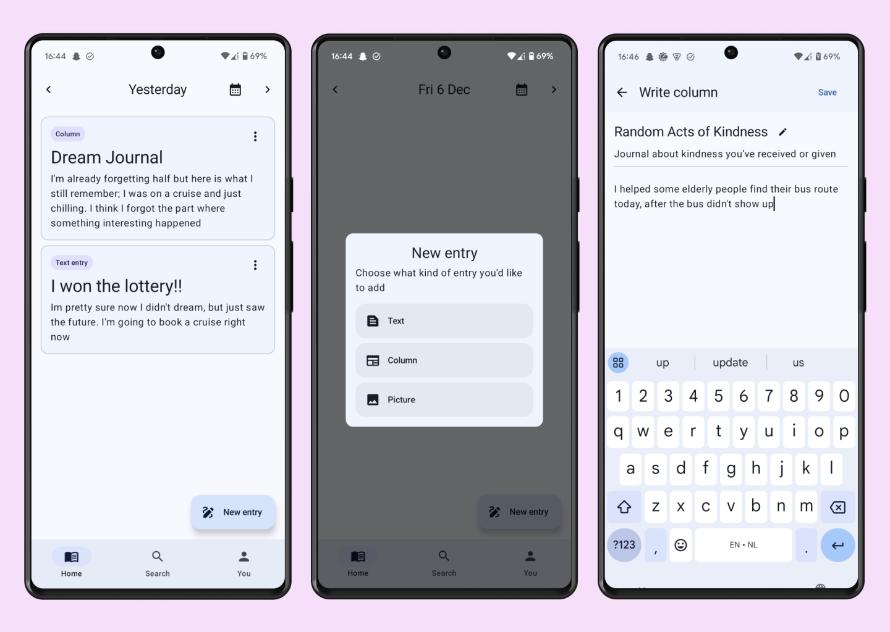

# Quibble
This is Quibble, a simple Android Compose app used for journaling. It currently only support text entries, but I plan on expanding it in the future.

## Features
These are some of the technological parts that might make this app a little more interesting (at least to me):

- **Routing** using Compose Navigation
- **Data saving** using a *SQLite* database powered by *Room*

## Preview

